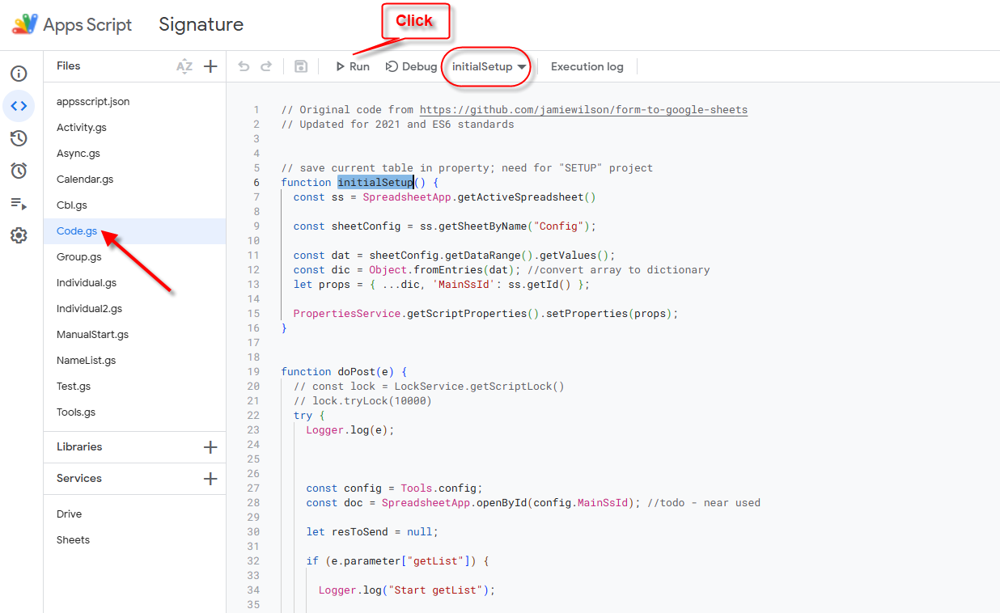
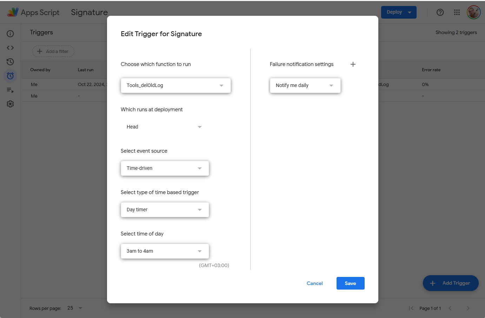
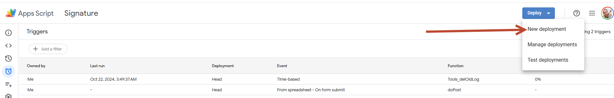
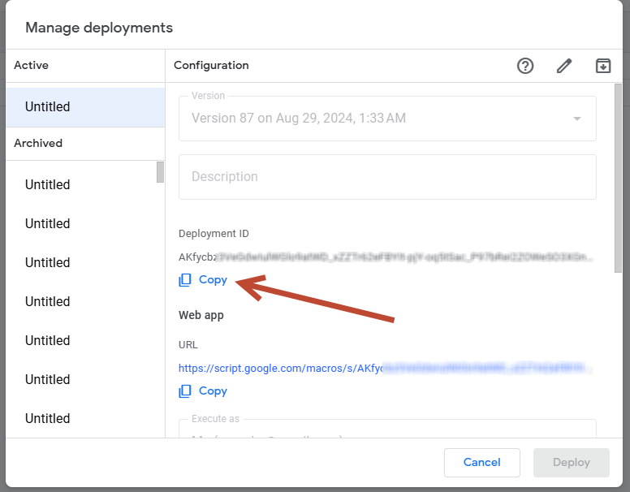

## Программа специального назначения для специального клиента

GitHub - клиентская часть (броузер клиент), для использования GitHub Page

## В случае возникновения ошибки невозможности конвертирования image

1. Скопировать таблицу с другим именем (например, **SignOld_yyyymmdd**) 
2. Выполнить меню: File/Make a Copy - и сохранить с именем **Sign**
3. Меню: Extetnsion/App Script
4. Открыть файл "Code.js"
5. Запустить (Run) функцию "**initialSetup**"

||
|-|

6. Сделать DoPostTrigger
- function - **doPost**
- eventType - **On form submit**

7. Сделать Deploy Script

||
|-|

||
|-|

Скопировать DeployId и использовать ее как параметр

||
|-|

    
 